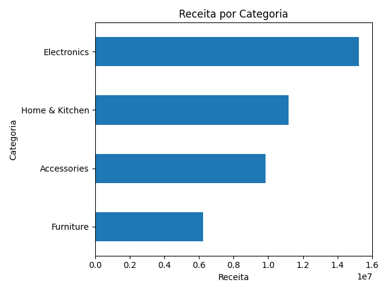
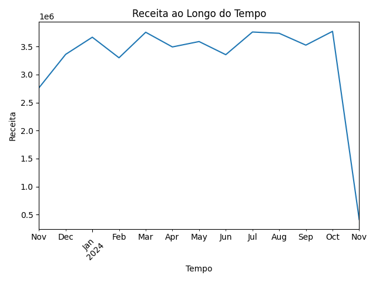
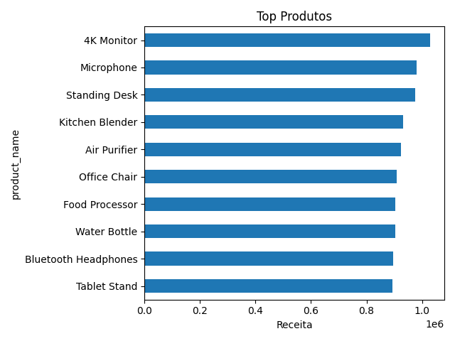
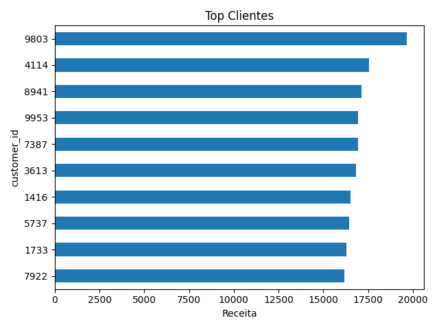
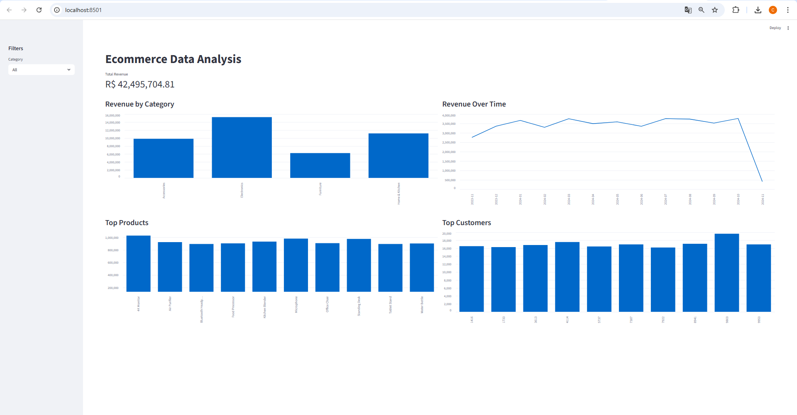

# Ecommerce Data Analysis

## Overview
End-to-end e-commerce data analysis project, transforming raw data into business insights and an interactive dashboard.

---

## Tech Stack

  
  
  
  

---

## Project Structure

- data/ → raw and processed data  
- src/ → data pipeline and analysis  
- dashboard/ → interactive app  
- reports/ → visual outputs  
- main.py → execution pipeline  

---

## Data Pipeline

1. Data Loading  
2. Data Transformation  
3. Feature Engineering  
4. Data Export  
5. Analysis & Visualization  

---

## Visualizations

### Revenue by Category

  

---

### Revenue Over Time

  

---

### Top Products

  

---

### Top Customers

  

---

## Dashboard

  

---

## Key Insights

- Electronics is the leading revenue category  
- Sales show temporal variation (possible seasonality)  
- Revenue is concentrated in a small number of products  
- High-value customers drive a significant portion of revenue  

---

## How to Run

Install dependencies:
    pip install -r requirements.txt

Run pipeline:
    python main.py

Run dashboard:
    streamlit run dashboard/app.py

---

## Dataset

https://www.kaggle.com/datasets/marthadimgba/online-shop-2024

---

## Conclusion

This project demonstrates:
- Data analysis and transformation  
- Business insight generation  
- Data visualization  
- Dashboard development  
